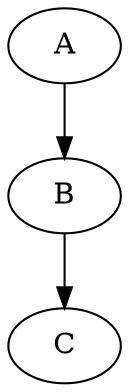
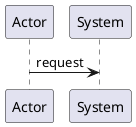
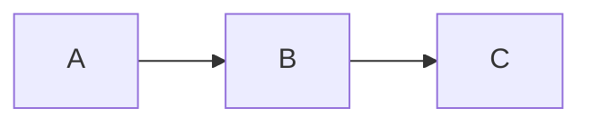

# D2lang: практическое руководство

## Зачем нужны диаграммы

Диаграммы показывают структуру процессов, код — детали реализации. 
Когда вы документируете 
- рабочие процессы 
- архитектуру 
- или бизнес-логику 
визуальная схема экономит часы объяснений. 

D2 создает диаграммы через текстовый код.

## История текстовых диаграмм

### Graphviz (1991)



### PlantUML (2009)



### Mermaid.js (2014)



### D2lang (2022)

```d2
direction: right
A -> B -> C
```

## Структура D2

### Объекты

Объект — базовый элемент диаграммы.

```d2
# Простой объект
Server

# С меткой
Database: "PostgreSQL\nPrimary"

# Со стилем
API Gateway: {
  shape: rectangle
  style.fill: "#e1f5fe"
}
```

### Связи

Связь определяет отношения между объектами.

```d2
# Простая связь
Frontend -> Backend

# С меткой
User -> Auth: "login"

# Со стилем
Service -> DB: {
  stroke: dashed
}
```

### Контейнеры

Группируют связанные объекты.

```d2
cluster: {
  Backend Services
  Database
}

subgraph API Layer {
  Gateway
  Auth Service
}
```

## Code-driven vs GUI: Поддерживаемость

| Аспект            | GUI инструменты               | D2                    |
|-------------------|-------------------------------|-----------------------|
| Версионирование   | Бинарные файлы, diff нечитаем | Текст, Git tracking   |
| История изменений | Сложно отследить              | Четкий commit history |
| Откат изменений   | Ручной                        | Git revert            |

## Code-driven vs GUI: Переиспользование

| Аспект     | GUI инструменты     | D2                   |
|------------|---------------------|----------------------|
| Компоненты | Копирование-вставка | Импорт, наследование |
| Стили      | Ручное применение   | Темы, wildcard       |
| Шаблоны    | Ограничены          | Библиотеки паттернов |

## Code-driven vs GUI: Масштабирование

| Аспект             | GUI инструменты          | D2             |
|--------------------|--------------------------|----------------|
| Размер холста      | Ограничен                | Безграничный   |
| Авто-лейаут        | Ручной                   | Автоматический |
| Производительность | Падает на больших схемах | Стабильная     |

## Практические кейсы

### ERD для системы управления пользователями
таблицы с полями и связями:
- users 
- roles 
- permissions 

- тип показывает структуру таблицы 
- стрелки указывают cardinality 
### Sequence диаграмма бизнес-процесса
- поток согласования документа через 
  - менеджера 
  - юриста
  - директора 
- разные типы стрелок для синхронных/асинхронных шагов. 
- легко добавить новый этап согласования.

### Контекстная схема отдела
общая карта взаимодействий между отделами компании. 
разные формы для 
- департаментов 
- внешних подрядчиков 
- систем

цвета показывают тип взаимодействия 
### Алгоритм обработки заказов
- от создания до доставки. 
- группировка этапов 
- разные стили для ручных и автоматических операций 
- показывает узкие места и параллельные процессы

## Преимущества D2

один язык для всех типов диаграмм, версионирование изменений, автоматический лейаут, интеграция с markdown.

## Ограничения D2

нужно изучить синтаксис, меньше контроля над точным позиционированием, сложнее совместное редактирование.

## Экосистема

VS Code extension, интеграция с Obsidian, CLI для CI/CD, растущее сообщество.
