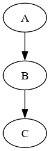
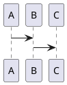
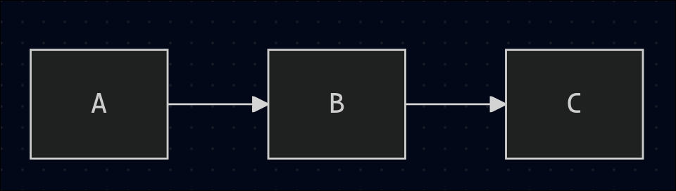
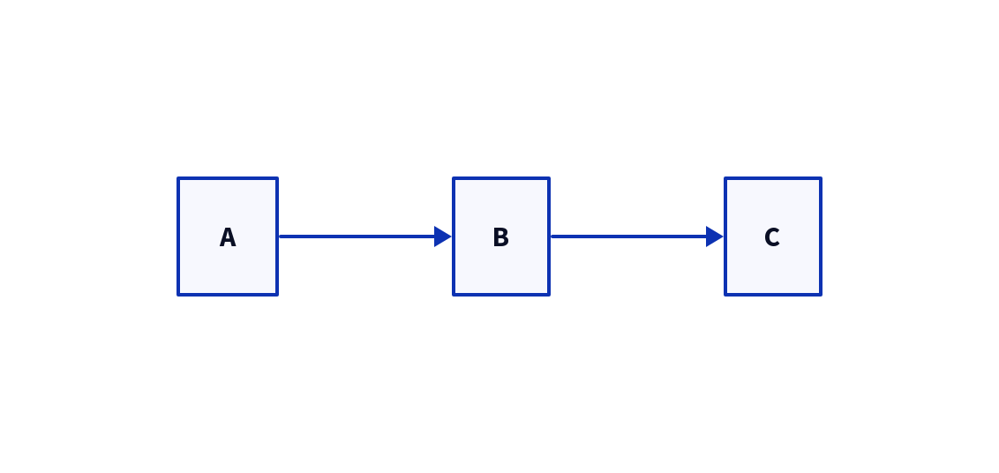
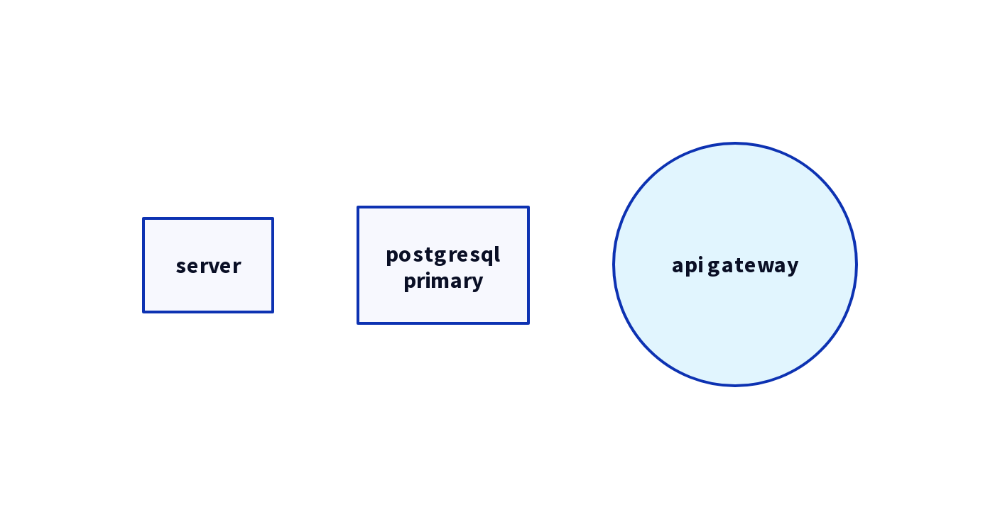
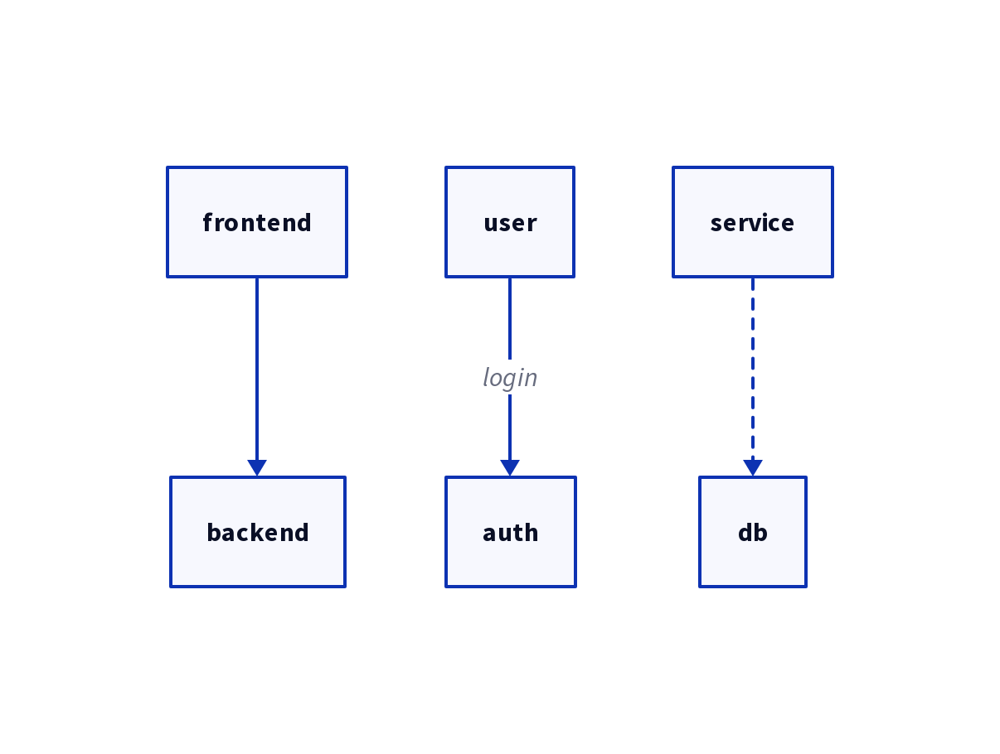
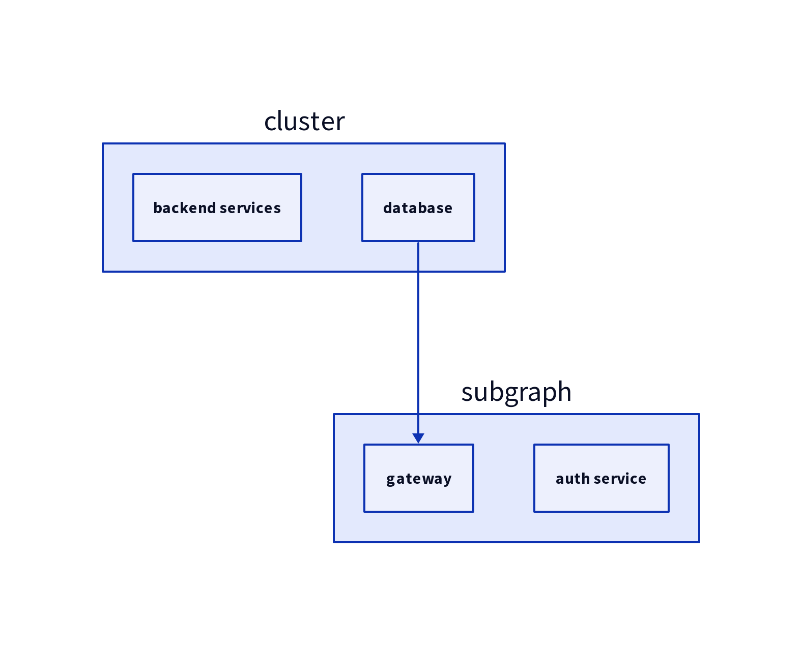

#+TITLE: d2lang: Практическое руководство
#+AUTHOR: veschin
#+OPTIONS: toc:nil \n:t
# #+REVEAL_EXTRA_CSS: .slide {overflow-y: auto;}
# #+REVEAL_EXTRA_INITIAL_JS:
* зачем нужны диаграммы
диаграммы показывают структуру процессов,
код - детали реализации.

d2 создает диаграммы через текстовый код, когда вы документируете
- рабочие процессы
- архитектуру
- или бизнес-логику

визуальная схема экономит часы объяснений.

* история текстовых диаграмм
** graphviz (1991)
#+begin_src plantuml
digraph g {
  a -> b;
  b -> c;
}
#+end_src

#+results:

** plantuml (2009)
#+begin_src plantuml
@startuml
a -> b
b -> c
@enduml
#+end_src

#+results:

** mermaid.js (2014)
#+begin_src mermaid
graph lr
  a --> b
  b --> c
#+end_src

** d2lang (2022)
#+begin_src d2 :file ./img/d2.png
direction: right
a -> b -> c
#+end_src

#+results:

* структура d2
** объекты
объект - базовый элемент диаграммы.

#+begin_src d2 :file ./img/d2-obj.png
# простой объект
server
# с меткой
database: "postgresql\nprimary"
# со стилем
api gateway: {
  shape: circle
  style.fill: "#e1f5fe"
}
#+end_src
#+results:

** связи
связь определяет отношения между объектами.
#+begin_src d2 :file ./img/d2-links.png
# простая связь
frontend -> backend
# с меткой
user -> auth: "login"
# со стилем
service -> db: {style.stroke-dash: 3}
#+end_src
#+results:

** контейнеры
группируют связанные объекты.
#+begin_src d2 :file ./img/d2-containers.png
cluster: {
  backend services
  database
}
subgraph: {
  gateway
  auth service
}
cluster.database -> subgraph.gateway
#+end_src

#+RESULTS:

* поддерживаемость
| аспект            | gui-driven            | code-driven           |
|-------------------+-----------------------+-----------------------|
| версионирование   | бинарные файлы        | код                   |
| история изменений | зависит от реализации | легкий commit history |
| откат изменений   | зависит от реализации | git revert            |
* переиспользование
| аспект     | gui-driven          | code-driven               |
|------------+---------------------+---------------------------|
| компоненты | копирование-вставка | копирование, наследование |
| стили      | ручное применение   | темы, wildcard            |
| шаблоны    | ограничены          | библиотеки паттернов      |
* масштабирование
| аспект             | gui-driven            | code-driven    |
|--------------------+-----------------------+----------------|
| размер холста      | зависит от реализации | безграничный   |
| авто-лейаут        | ручной                | автоматический |
| производительность | зависит от реализации | стабильная     |
* практические кейсы
** erd для системы управления пользователями
таблицы с полями и связями:
- users
- roles
- permissions

- тип показывает структуру таблицы
- стрелки указывают cardinality
** sequence диаграмма бизнес-процесса
- поток согласования документа через
  - менеджера
  - юриста
  - директора
- разные типы стрелок для синхронных/асинхронных шагов.
- легко добавить новый этап согласования.
** контекстная схема отдела
общая карта взаимодействий между отделами компании. разные формы для
- департаментов
- внешних подрядчиков
- систем
цвета показывают тип взаимодействия
** алгоритм обработки заказов
- от создания до доставки.
- группировка этапов
- разные стили для ручных и автоматических операций
- показывает узкие места и параллельные процессы
* преимущества d2
один язык для всех типов диаграмм, версионирование изменений,
автоматический лейаут, интеграция с markdown.
* ограничения d2
нужно изучить синтаксис, меньше контроля над точным позиционированием,
сложнее совместное редактирование.
* экосистема
vs code extension, интеграция с obsidian, cli для ci/cd, растущее
сообщество.
